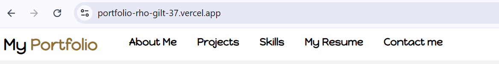
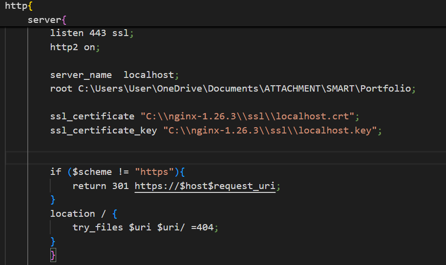
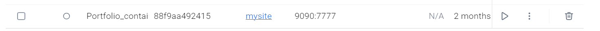
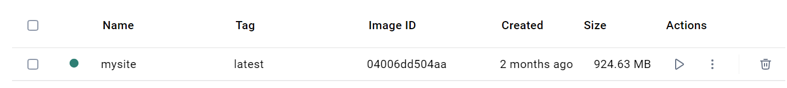
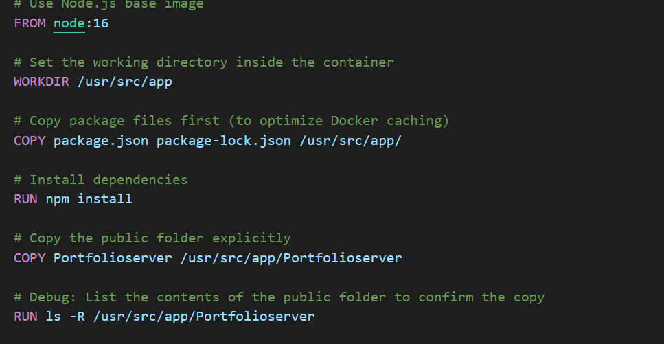

# SUMMARY OF THE ATTACHHMENT PROCESS
These are the projects done and completed during my three month attachment program at Smart Applications International Limited.
They are a proof of hardwork and consistency mad  during this period  and the willingness to learn.
I am grateful for this opportunity given to me by this Great establishment!!!

## Portfolio website development and deployment{#1}
[WEBSITE LINK](https://portfolio-rho-gilt-37.vercel.app/)
### HTML and CSS part
I got to learn;

    1.Website responsivity
    2. Essential HTML concepts
    3. Essential CSS concepts
    4. SCSS concepts which asissted with the  ease of website styling.

I experienced challenges such as :

    1. I had issues with dividing my divs I ended up making unnecessary div tags and unnecessary classes and ids
    2. Still didn't have experiences with other html elements concepts
    3. Had css issues with padding and alignment of the elements (box model issues)
    4. It was pretty challenging when I had to include responsiveness to the website
    5. Alot of delay in image loading.

Nevertheless, the experience was very engaging and proved to be an **eye-opener** towards my journey of web development.

### Deploying it on a open source deploying website (On Vercel) [Vercel](https://vercel.com/)

I got to learn about deployng my website on Vercel. I chose vercel because it was easy to use it and it was user friendly. Ofcourse there were other websites like Netlify etc but this website stood out  the most.
Some of the challenges occured were:

    1. Directory arrangement where I had to arrange my files well so that the main page could be seen.
    2. Still was learning of git commands to push my changes and doing it with ease.

Heres and image snip of the website url;

### Serving it with Nginx (both HTTP and HTTPS)
I got to learn about hosting my website on Nginx which proved to be an educative challenge and further brought to my exposure towards backend programming.
I got to learn about;

    1. Static website hosting
    2. Directory arrangement
    3. Https hosting 
    4. SSL certificate
    5. domain accepted certificates and self accepting certificates

Challenges were  many which included;

    1. Learning Nginx proved to be challenging since it was very broad for something under a very short time.
    2. Directory rendering so that I could put the right directory for hosting.
    3. Secure hosting was a well known concept theoretically but practically was really tough.
    4. Getting the certificates from a well known open source certificate-giving website  I had to create a self-accepting certificate using Powershell.
    5. Some of the powershell commands were hard to grasp so I had to refer often.

Nevertheless it **proved** to be an awesome challenge that I managed to host my website both statically and dynamically securerly. I also got to learn some scripting which was a well bound challenge..

### Serving the website and deploying it with Docker

This was beyond the **most challenging** concept which sparked my curiosity and love for DevOps engineering.
I got to learn alot especially regarding:

        1. Docker scripts and code.
        2. JSON commands to use when dockerizing the images
        3. Docker codes to execute the scripts previously written
        4.  Problem solving and Crritical thinking
        5. Containerization and Docker imaging
        6. Assigning different IP adresses for the websites

Challenges include:

        1. Learning the Docker scripts and commands which were quite many.
        2. Writing codes in JSON format and integrating it with the Docker code proved to be difficult but eventually managed to do it.
        3. Some commands were  not accepted by the PowerShell on the VsCode, I  had to put some Bypass some authorization

This was a wonderful experience that I got to learn alot regarding Pipelinig codes , CI/CD. It might have been some few lines of easy code but this proves to be a stepping stone toward my journey into DevOps and Cloud engineering career.

This is the Docker container snippet:

This is the Docker image snippet:

This is the Docker code snippet:

